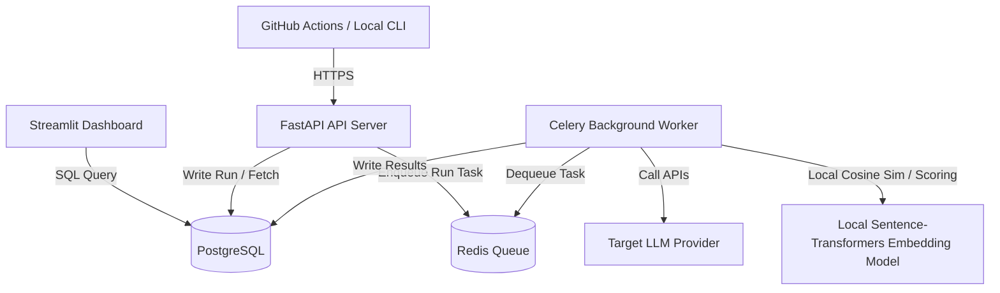

# Aegis Architecture Documentation

This document describes the architectural layout, component roles, and data flow of the Aegis LLM Evaluation and Observability Framework.

## 1. High-Level Design

## 2. Component Designations

* **FastAPI Server**: Front desk HTTP server exposing REST API endpoints to trigger test runs, manage suites, retrieve run statuses, and query logs.
* **Celery Worker**: Background task executor that processes run tasks, makes external LLM calls (via OpenAI or Groq), performs local evaluations (embeddings, schema assertions), and writes scoring metrics.
* **Redis**: Acts as the Celery task message broker and transient results backend cache.
* **PostgreSQL**: Serves as the persistent database engine storing configurations, projects, test cases, runs, and final metric scores.

## 3. Core Database Tables

The PostgreSQL database maintains the following entities (initialized via [init.sql](file:///C:/Users/loyal/OneDrive/Desktop/Aegis/infra/init.sql)):

* **`projects`**: Top-level namespace grouping test suites.
* **`test_suites`**: Logical groupings of related test cases.
* **`test_cases`**: Test specifications holding prompts, expected outputs, and assertion rules.
* **`runs`**: Execution entries documenting model names, status, and completion times.
* **`test_results`**: Output details per test case containing token counts, latency, and actual text outputs.
* **`metric_scores`**: Calculated metrics (e.g., cosine similarity, LLM-as-judge score) per test case result.
